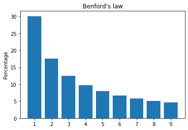
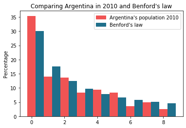
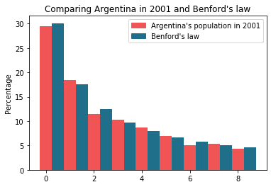
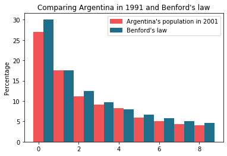
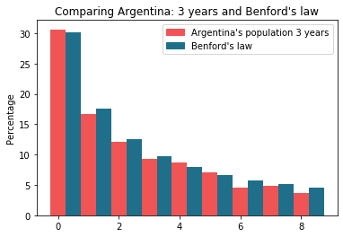

# Bendford's law

Bendford's law  is an observation about the frequency distribution of leading digits in many real-life sets of numerical data. The law states that in many naturally occurring collections of numbers, the leading digit is likely to be small. 
In sets that obey the law, the number 1 appears as the leading significant digit about 30% of the time, while 9 appears as the leading significant digit less than 5% of the time. If the digits were distributed uniformly, they would each occur about 11.1% of the time.
I applied this law to an Argentinian population Dataset organized by cities in the years 2010, 2001, 1991 to check if the law is accurate. 


```python
import numpy as np
import pandas as pd
import matplotlib.pyplot as plt
import matplotlib.patches as mpatches
%matplotlib inline
```

## The Benford's law diagram


```python
plt.title("Benford's law")
plt.ylabel('Percentage')
plt.bar(['1','2','3','4','5','6','7','8','9'],[30.1, 17.6, 12.5, 9.7, 7.9, 6.7, 5.8, 5.1, 4.6])
plt.show()
```


    

    


## Argentina's population in 2010


```python
population = pd.read_excel("population_by_city.xlsx")
population

```


<div>
<style scoped>
    .dataframe tbody tr th:only-of-type {
        vertical-align: middle;
    }

    .dataframe tbody tr th {
        vertical-align: top;
    }

    .dataframe thead th {
        text-align: right;
    }
</style>
<table border="1" class="dataframe">
  <thead>
    <tr style="text-align: right;">
      <th></th>
      <th>PROVINCE</th>
      <th>CITY</th>
      <th>POP2010</th>
      <th>POP2001</th>
      <th>POP1991</th>
    </tr>
  </thead>
  <tbody>
    <tr>
      <th>0</th>
      <td>Buenos Aires</td>
      <td>Adolfo Alsina</td>
      <td>17072</td>
      <td>16245.0</td>
      <td>18077.0</td>
    </tr>
    <tr>
      <th>1</th>
      <td>Buenos Aires</td>
      <td>Adolfo Gonzáles Chaves</td>
      <td>12047</td>
      <td>12037.0</td>
      <td>12747.0</td>
    </tr>
    <tr>
      <th>2</th>
      <td>Buenos Aires</td>
      <td>Alberti</td>
      <td>10654</td>
      <td>10373.0</td>
      <td>10627.0</td>
    </tr>
    <tr>
      <th>3</th>
      <td>Buenos Aires</td>
      <td>Almirante Brown</td>
      <td>552902</td>
      <td>515556.0</td>
      <td>450698.0</td>
    </tr>
    <tr>
      <th>4</th>
      <td>Buenos Aires</td>
      <td>Arrecifes</td>
      <td>29044</td>
      <td>27279.0</td>
      <td>24593.0</td>
    </tr>
    <tr>
      <th>...</th>
      <td>...</td>
      <td>...</td>
      <td>...</td>
      <td>...</td>
      <td>...</td>
    </tr>
    <tr>
      <th>2218</th>
      <td>Tucumán</td>
      <td>Villa de Leales</td>
      <td>54949</td>
      <td>2983.0</td>
      <td>2570.0</td>
    </tr>
    <tr>
      <th>2219</th>
      <td>Tucumán</td>
      <td>Villa Quinteros</td>
      <td>63641</td>
      <td>4647.0</td>
      <td>3965.0</td>
    </tr>
    <tr>
      <th>2220</th>
      <td>Tucumán</td>
      <td>Yánima</td>
      <td>19002</td>
      <td>1314.0</td>
      <td>1171.0</td>
    </tr>
    <tr>
      <th>2221</th>
      <td>Tucumán</td>
      <td>Yerba Buena</td>
      <td>75076</td>
      <td>50783.0</td>
      <td>36311.0</td>
    </tr>
    <tr>
      <th>2222</th>
      <td>Tucumán</td>
      <td>Yerba Buena (S)</td>
      <td>30876</td>
      <td>2672.0</td>
      <td>3029.0</td>
    </tr>
  </tbody>
</table>
<p>2223 rows × 5 columns</p>
</div>


### Select only the population in 2010


```python
population2010 = population.loc[:,["POP2010"]]
```


```python
population2010.dtypes
```


    pob2010    int64
    dtype: object


```python
serie = population2010.apply(pd.Series).stack().reset_index(drop=True)
serie
```


    0        17072
    1        12047
    2        10654
    3       552902
    4        29044
             ...  
    2218     54949
    2219     63641
    2220     19002
    2221     75076
    2222     30876
    Length: 2223, dtype: int64


```python
type(serie)
```


    pandas.core.series.Series


```python
list_population = serie.tolist()
```

### Separate tha first digit and count each one


```python
first_list = []
for num in list_population:
    num = str(num)
    first = num[0:1]
    first_list.append(first)

```


```python
n1=0
n2=0
n3=0
n4=0
n5=0
n6=0
n7=0
n8=0
n9=0
n0=0

for num in first_list:
    if(num=="1"):
        n1 = n1+1
    elif(num=="2"):
        n2 = n2+1  
    elif(num=="3"):
        n3 = n3+1  
    elif(num=="4"):
        n4 = n4+1  
    elif(num=="5"):
        n5 = n5+1  
    elif(num=="6"):
        n6 = n6+1  
    elif(num=="7"):
        n7 = n7+1
    elif(num=="8"):
        n8 = n8+1
    elif(num=="9"):
        n9 = n9+1
    elif(num=="0"):
        n0 = n0+1
    else:
        pass
```

### Calculate the percentage of each number


```python
one_percent = (n1+n2+n3+n4+n5+n6+n7+n8+n9+n0)/100
```


```python
n1_pc = np.round(n1/one_percent,1)
print(n1_pc)
```

    35.4
    


```python
n2_pc = np.round(n2/one_percent,1)
print(n2_pc)
```

    13.9
    


```python
n3_pc = np.round(n3/one_percent,1)
print(n3_pc)
```

    13.7
    


```python
n4_pc = np.round(n4/one_percent,1)
print(n4_pc)
```

    8.3
    


```python
n5_pc = np.round(n5/one_percent,1)
print(n5_pc)
```

    9.3
    


```python
n6_pc = np.round(n6/one_percent,1)
print(n6_pc)
```

    8.3
    


```python
n7_pc = np.round(n7/one_percent,1)
print(n7_pc)
```

    3.6
    


```python
n8_pc = np.round(n8/one_percent,1)
print(n8_pc)
```

    4.9
    


```python
n9_pc = np.round(n9/one_percent,1)
print(n9_pc)
```

    2.6
    

### Create a bar diagram to confronte the reality and the theory


```python
plt.title("Comparing Argentina in 2010 and Benford's law")
red_patch = mpatches.Patch(color="#f05454", label="Argentina's population 2010")
blue_patch = mpatches.Patch(color="#1f6f8b", label="Benford's law")
plt.legend(handles=[red_patch, blue_patch])
plt.ylabel("Percentage")
# plt.xlabel('1','2','3','4','5','6','7','8','9')
data = [[n1_pc, n2_pc, n3_pc, n4_pc, n5_pc, n6_pc, n7_pc, n8_pc, n9_pc], [30.1, 17.6, 12.5, 9.7, 7.9, 6.7, 5.8, 5.1, 4.6]]
x = np.arange(9)
plt.bar(x + 0.00, data[0], color="#f05454", width = 0.5)
plt.bar(x + 0.5, data[1], color="#1f6f8b", width = 0.5)
plt.show()
```


    

    


```python
pc1 = round((((n1_pc/30.1)*100)-100),2)
pc2 = round((((n2_pc/17.6)*100)-100),2)
pc3 = round((((n3_pc/12.5)*100)-100),2)
pc4 = round((((n4_pc/9.7)*100)-100),2)
pc5 = round((((n5_pc/7.9)*100)-100),2)
pc6 = round((((n6_pc/6.7)*100)-100),2)
pc7 = round((((n7_pc/5.8)*100)-100),2)
pc8 = round((((n8_pc/5.1)*100)-100),2)
pc9 = round((((n9_pc/4.6)*100)-100),2)
pctotal = pc1+pc2+pc3+pc4+pc5+pc6+pc7+pc8+pc9
accuracy = np.round((pctotal/9),2) 
print("Accuracy: " + str(accuracy) + "%")
```

    Accuracy: -5.77%
    

## Argentina's population in 2001


```python
population2001 = population.loc[:,["POP2001"]]

serie2001 = population2001.apply(pd.Series).stack().reset_index(drop=True)

list_population2001 = serie2001.tolist()

first_list2001 = []

for num in list_population2001:
    num = str(num)
    first = num[0:1]
    first_list2001.append(first)

n101=0
n201=0
n301=0
n401=0
n501=0
n601=0
n701=0
n801=0
n901=0
n001=0

for num in first_list2001:
    if(num=="1"):
        n101 = n101+1
    elif(num=="2"):
        n201 = n201+1  
    elif(num=="3"):
        n301 = n301+1  
    elif(num=="4"):
        n401 = n401+1  
    elif(num=="5"):
        n501 = n501+1  
    elif(num=="6"):
        n601 = n601+1  
    elif(num=="7"):
        n701 = n701+1
    elif(num=="8"):
        n801 = n801+1
    elif(num=="9"):
        n901 = n901+1
    elif(num=="0"):
        n001 = n001+1
    else:
        pass
    
one_percent2001 = (n101+n201+n301+n401+n501+n601+n701+n801+n901+n001)/100

n101_pc = np.round(n101/one_percent2001,1)
n201_pc = np.round(n201/one_percent2001,1)
n301_pc = np.round(n301/one_percent2001,1)
n401_pc = np.round(n401/one_percent2001,1)
n501_pc = np.round(n501/one_percent2001,1)
n601_pc = np.round(n601/one_percent2001,1)
n701_pc = np.round(n701/one_percent2001,1)
n801_pc = np.round(n801/one_percent2001,1)
n901_pc = np.round(n901/one_percent2001,1)
```


```python
plt.title("Comparing Argentina in 2001 and Benford's law")
red_patch = mpatches.Patch(color="#f05454", label="Argentina's population in 2001")
blue_patch = mpatches.Patch(color="#1f6f8b", label="Benford's law")
plt.legend(handles=[red_patch, blue_patch])
plt.ylabel("Percentage")
# plt.xlabel('1','2','3','4','5','6','7','8','9')
data = [[n101_pc, n201_pc, n301_pc, n401_pc, n501_pc, n601_pc, n701_pc, n801_pc, n901_pc], [30.1, 17.6, 12.5, 9.7, 7.9, 6.7, 5.8, 5.1, 4.6]]
x = np.arange(9)
plt.bar(x + 0.00, data[0], color="#f05454", width = 0.5)
plt.bar(x + 0.5, data[1], color="#1f6f8b", width = 0.5)
plt.show()
```


    

    


```python
pc1 = round((((n101_pc/30.1)*100)-100),2)
pc2 = round((((n201_pc/17.6)*100)-100),2)
pc3 = round((((n301_pc/12.5)*100)-100),2)
pc4 = round((((n401_pc/9.7)*100)-100),2)
pc5 = round((((n501_pc/7.9)*100)-100),2)
pc6 = round((((n601_pc/6.7)*100)-100),2)
pc7 = round((((n701_pc/5.8)*100)-100),2)
pc8 = round((((n801_pc/5.1)*100)-100),2)
pc9 = round((((n901_pc/4.6)*100)-100),2)
pctotal = pc1+pc2+pc3+pc4+pc5+pc6+pc7+pc8+pc9
accuracy = np.round((pctotal/9),2) 
print("Accuracy: " + str(accuracy) + "%")
```

    Accuracy: -0.12%
    

## Argentina's population in 1991


```python
population1991 = population.loc[:,["POP1991"]]

serie1991 = population1991.apply(pd.Series).stack().reset_index(drop=True)

list_population1991 = serie1991.tolist()

first_list1991 = []

for num in list_population1991:
    num = str(num)
    first = num[0:1]
    first_list1991.append(first)

n191=0
n291=0
n391=0
n491=0
n591=0
n691=0
n791=0
n891=0
n991=0
n091=0

for num in first_list1991:
    if(num=="1"):
        n191 = n191+1
    elif(num=="2"):
        n291 = n291+1  
    elif(num=="3"):
        n391 = n391+1  
    elif(num=="4"):
        n491 = n491+1  
    elif(num=="5"):
        n591 = n591+1  
    elif(num=="6"):
        n691 = n691+1  
    elif(num=="7"):
        n791 = n791+1
    elif(num=="8"):
        n891 = n891+1
    elif(num=="9"):
        n991 = n991+1
    elif(num=="0"):
        n091 = n091+1
    else:
        pass
    
one_percent1991 = (n101+n201+n301+n401+n501+n601+n701+n801+n901+n001)/100

n191_pc = np.round(n191/one_percent1991,1)
n291_pc = np.round(n291/one_percent1991,1)
n391_pc = np.round(n391/one_percent1991,1)
n491_pc = np.round(n491/one_percent1991,1)
n591_pc = np.round(n591/one_percent1991,1)
n691_pc = np.round(n691/one_percent1991,1)
n791_pc = np.round(n791/one_percent1991,1)
n891_pc = np.round(n891/one_percent1991,1)
n991_pc = np.round(n991/one_percent1991,1)
```


```python
plt.title("Comparing Argentina in 1991 and Benford's law")
red_patch = mpatches.Patch(color="#f05454", label="Argentina's population in 2001")
blue_patch = mpatches.Patch(color="#1f6f8b", label="Benford's law")
plt.legend(handles=[red_patch, blue_patch])
plt.ylabel("Percentage")
# plt.xlabel('1','2','3','4','5','6','7','8','9')
data = [[n191_pc, n291_pc, n391_pc, n491_pc, n591_pc, n691_pc, n791_pc, n891_pc, n991_pc], [30.1, 17.6, 12.5, 9.7, 7.9, 6.7, 5.8, 5.1, 4.6]]
x = np.arange(9)
plt.bar(x + 0.00, data[0], color="#f05454", width = 0.5)
plt.bar(x + 0.5, data[1], color="#1f6f8b", width = 0.5)
plt.show()
```


    

    


```python
pc1 = round((((n191_pc/30.1)*100)-100),2)
pc2 = round((((n291_pc/17.6)*100)-100),2)
pc3 = round((((n391_pc/12.5)*100)-100),2)
pc4 = round((((n491_pc/9.7)*100)-100),2)
pc5 = round((((n591_pc/7.9)*100)-100),2)
pc6 = round((((n691_pc/6.7)*100)-100),2)
pc7 = round((((n791_pc/5.8)*100)-100),2)
pc8 = round((((n891_pc/5.1)*100)-100),2)
pc9 = round((((n991_pc/4.6)*100)-100),2)
pctotal = pc1+pc2+pc3+pc4+pc5+pc6+pc7+pc8+pc9
accuracy = np.round((pctotal/9),2) 
print("Accuracy: " + str(accuracy) + "%")
```

    Accuracy: -7.95%
    

## 3-yars average

Calculate the average population of the 3 years (1991, 2001, and 2010) and notice how the error is smaller and nearest the Bendford model.


```python
n1ave= np.round(((n1_pc+n101_pc+n191_pc)/3),2)
n2ave= np.round(((n2_pc+n201_pc+n291_pc)/3),2)
n3ave= np.round(((n3_pc+n301_pc+n391_pc)/3),2)
n4ave= np.round(((n4_pc+n401_pc+n491_pc)/3),2)
n5ave= np.round(((n5_pc+n501_pc+n591_pc)/3),2)
n6ave= np.round(((n6_pc+n601_pc+n691_pc)/3),2)
n7ave= np.round(((n7_pc+n701_pc+n791_pc)/3),2)
n8ave= np.round(((n8_pc+n801_pc+n891_pc)/3),2)
n9ave= np.round(((n9_pc+n901_pc+n991_pc)/3),2)
```


```python
plt.title("Comparing Argentina: 3 years and Benford's law")
red_patch = mpatches.Patch(color="#f05454", label="Argentina's population 3 years")
blue_patch = mpatches.Patch(color="#1f6f8b", label="Benford's law")
plt.legend(handles=[red_patch, blue_patch])
plt.ylabel("Percentage")
data = [[n1ave, n2ave, n3ave, n4ave, n5ave, n6ave, n7ave, n8ave, n9ave], [30.1, 17.6, 12.5, 9.7, 7.9, 6.7, 5.8, 5.1, 4.6]]
x = np.arange(9)
plt.bar(x + 0.00, data[0], color="#f05454", width = 0.5)
plt.bar(x + 0.5, data[1], color="#1f6f8b", width = 0.5)
plt.show()
```


    

    


```python
benford_list = [30.1, 17.6, 12.5, 9.7, 7.9, 6.7, 5.8, 5.1, 4.6]
benford_tot =sum(benford_list)
benford_tot
average_list = [n1ave, n2ave, n3ave, n4ave, n5ave, n6ave, n7ave, n8ave, n9ave]
```


    100.0


```python
pc1 = round((((n1ave/30.1)*100)-100),2)
pc2 = round((((n2ave/17.6)*100)-100),2)
pc3 = round((((n3ave/12.5)*100)-100),2)
pc4 = round((((n4ave/9.7)*100)-100),2)
pc5 = round((((n5ave/7.9)*100)-100),2)
pc6 = round((((n6ave/6.7)*100)-100),2)
pc7 = round((((n7ave/5.8)*100)-100),2)
pc8 = round((((n8ave/5.1)*100)-100),2)
pc9 = round((((n9ave/4.6)*100)-100),2)
pctotal = pc1+pc2+pc3+pc4+pc5+pc6+pc7+pc8+pc9
accuracy = np.round((pctotal/9),2) 
print("Accuracy: " + str(accuracy) + "%")
```

    Accuracy: -4.6%
    

## Conclusions

This study project shows how Benford's law is accurate, the best score in the 2001 with an an error -0.12%.
I practiced the use of the libraries numpy, pandas and matplotlib and how to manipulate data type objects and series and how to create a bar diagram with details.
